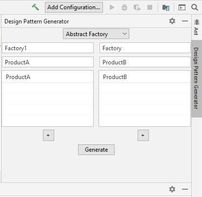
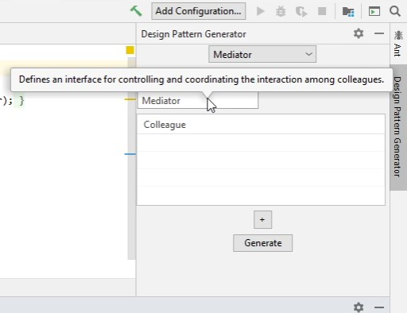
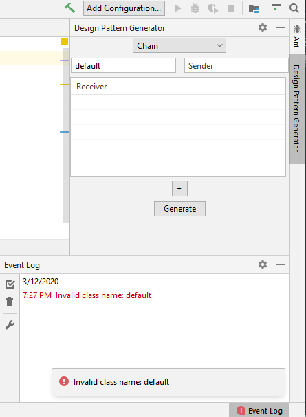

# Homework 2

## Build process

Once you have cloned the BitBucket directory you can run 
the simulations I've created using either gradle or the
gradle wrapper gradlew, depending on whether or not you have
gradle installed. If you don't you can install gradle yourself
or just use gradlew instead. For the following commands just
replace gradle with gradlew:

On Windows to create an intellij instance with the plugin
installed you'll need to run the command ```gradle run```. You'll
need to make sure that you run this command from the windows
command prompt instead of other terminals like the Windows Subsystem
for Linux (WSL). I've successfully ran ```gradle run``` on both macOS
and Windows with the community edition of intellij version 2019.2.3.
I'm not sure how it will interact with other versions of intellij.

On linux you'll need to run these commands like ```./gradle```. You can
install gradle by entering the command ```sudo apt install gradle```.
If instead you choose to use gradlew you'll have to change the file 
permission to executable by using the command ```chmod +x gradlew```.

## Unit tests

To run the unit tests I've created just run ```gradle test```. This will run 6 unit tests
defined in the class [DesignPatternGeneratorTests](src/test/java/DesignPatternGeneratorTests.java).
These unit tests test the correctness of the compilation unit creation. This includes checking that
each compilation unit has only the correct class, with the correct fields, and methods. It also
checks that creating design pattern generators from config resources builds correctly. On this iteration
there is also an additional unit test to test the correctness of the [TextField](src/main/java/TextField.java) 
class created to manipulate the default text shown based on the fields focus. The logging
used by the other classes has been turned off for the unit tests to avoid polluting the output.

## Configuration file

On this iteration the configuration file [design-patterns.conf](src/main/resources/design-patterns.conf) 
is used to set the design patterns available, the default class names for each field pattern, 
and tool tips for each field of the pattern. This file should no longer be used by the user of 
the generator. The user should only interact with the GUI provided for the plugin.

## Design

This project uses the JavaParser library heavily. I've used the factory method by creating a class [DesignPatternGenFactory](src/main/java/DesignPatternGenFactory.java)
with a public static factory method that creates a [DesignPatternGenerator](src/main/java/DesignPatternGenerator.java)
based on the config resource provided. The abstract class DesignPatternGenerator stores and manages
the compilation units and provides several helper methods to build the various
parts of a class. These include methods to create and attach fields to classes,
add constructors to classes, and add various kinds of methods. Each of the subclasses
then use these methods to build their respective compilation units. This design
naturally allows the use of the template method in the base class. The generate method
of the [DesignPatternGenerator](src/main/java/DesignPatternGenerator.java) uses an abstract
build method defined by the subclasses, such as the [AbstractFactoryPatternGenerator](src/main/java/AbstractFactoryPatternGenerator.java).
The intellij sdk uses the factory method design pattern to create tool windows. I had to
implement the ```ToolWindowFactory``` interface inside of my [GeneratorToolWindowFactory](src/main/java/GeneratorToolWindowFactory.java)
class. The code for my specific tool window is inside of the [GeneratorToolWindow](src/main/java/GeneratorToolWindow.java) class.

## GUI / usage

The plugin is a dockable tool window. The user just
specifies the class names and then generates the 
necessary files. The plugin will store the files
generated inside of the first source root found in
the active project. If no source root is found then 
they'll be stored in the first content root found. 
This seemed like a reasonable approach. If there
already exists a file with the same filename as one
of the generated files, then the generated file is
not stored and the original file is not overwritten.
I didn't have time to make the GUI look well on 
both light and dark themes. Use a light theme as it's
a little hard to see on darcula.

### Default text

Each design pattern has a several
fields with default texts. The default
text is to help the user identify the
components of the design pattern.



### Tool tips

The fields of each design pattern also
includes a tool tip that displays when
the user hovers over the field. This tip
gives a description of the role that
the field plays in the chosen design pattern.



### Input validation
 
The plugin provides basic input validation.
This includes checking that the class names
provided in each field are valid class names
in Java. It also includes checking that the
class names are not keywords in Java. If it finds
an error it will report a notification to the
user. It will also log the error in the event log.
You can also see this error logged to the console.



